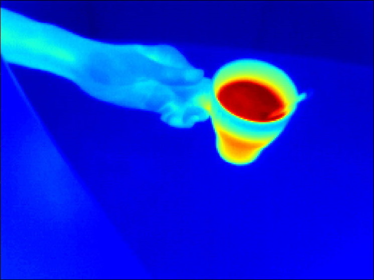
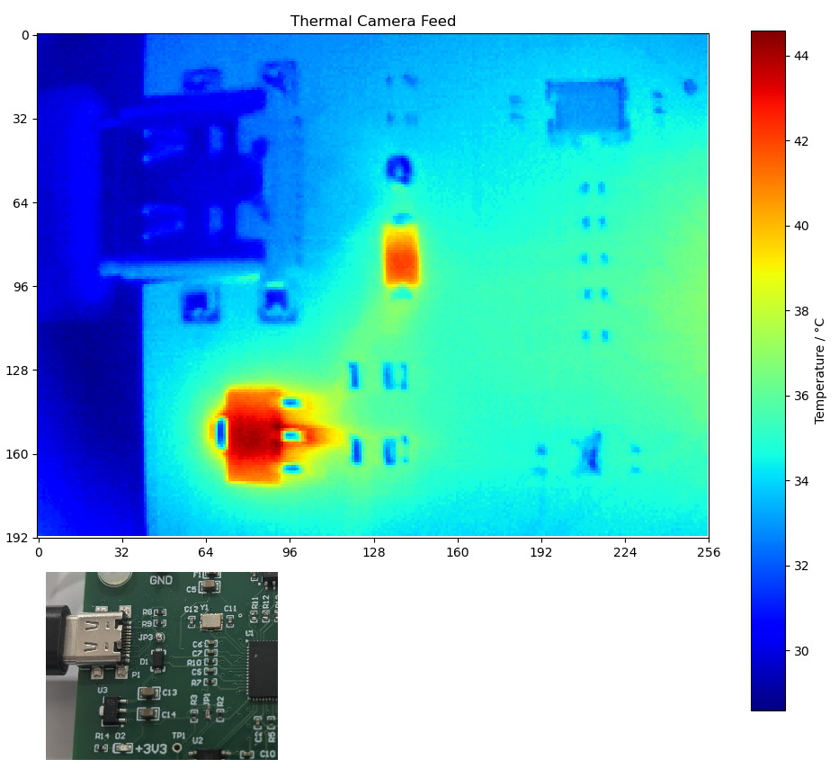
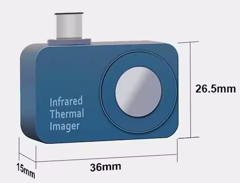

# Thermal Imaging with USB Camera

This project demonstrates how to pull temperature data (convertable to °C) from a USB camera and visualize it using Python.

There exists cheap USB-C thermal imaging camera from Chinese sources though the usage instructions is not very well documented, especially if you wish to integrate it into a larger system and thus need some SDK or API method to use the camera. The Python script in this library demonstrates how to do so.

Below are the capabilities of such a thermal imaging camera.

The camera is sensitive enough to detect a chip [turning on or off](docs/Turning on of component on PCB.mp4).

## Works with

| Image | Product Name | Resolution |
|-------|--------------|------------|
|  | TOOLTOP T7 | 256x192 |

## References

- [EEVBlog Forum Discussion](https://www.eevblog.com/forum/thermal-imaging/infiray-and-their-p2-pro-discussion/200/)
- [LeoDJ's Formula and Exploration](https://chaos.social/@LeoDJ/109633033381602083)
